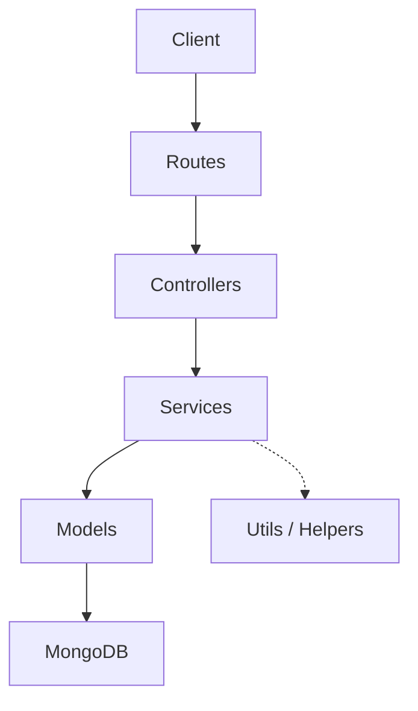

# Souknamasry Backend - Project Guide

Welcome to the **Souknamasry Backend** project! This guide is designed to provide you with a comprehensive understanding of the system, its architecture, and how to work with it.

---

## 🏗 Project Overview
**Souknamasry** is a modern e-commerce platform. This repository contains the **Backend API**, built with focus on scalability, security, and internationalization (Right-to-Left support for Arabic).

### Core Features
- **Authentication**: JWT-based secure auth with Register, Login, and Password management.
- **Product Catalog**: Dynamic categories, nested sub-categories, and detailed product listings.
- **Shopping Cart**: Full cart management (add, update, remove) with persistent storage.
- **Orders & Checkout**: Order lifecycle management and Stripe integration for payments.
- **Favourites**: Personalized wishlists for users.
- **Internationalization (i18n)**: Full support for English and Arabic, with automatic language detection.
- **Security**: Hardened with Helmet, XSS protection, and Rate Limiting.
- **Documentation**: Interactive API docs via Swagger.

---

## 🛠 Tech Stack
| Category | Technology |
| :--- | :--- |
| **Runtime** | Node.js (v18+) |
| **Framework** | Express.js (v5+) |
| **Language** | TypeScript |
| **Database** | MongoDB with Mongoose |
| **Validation** | Express Validator |
| **Security** | Helmet, CSRF, Rate Limit, BcryptJS |
| **Testing** | Jest & Supertest |
| **Documentation** | Swagger / OpenAPI |

---

## 📂 Architecture & Directory Structure
The project follows a **Layered Service Pattern**, separating concerns for better maintainability.



### Key Folders (`/src`)
- 📍 **`routes/`**: Defines the API endpoints (e.g., `/api/products`).
- 🎮 **`controllers/`**: Handles incoming requests, extracts data, and calls services.
- ⚙️ **`services/`**: Contains the **Business Logic**. This is where calculations, data transformations, and DB calls happen.
- 📄 **`models/`**: Defines the data structure (Schemas) for MongoDB.
- 🌐 **`locales/`**: Translation files for English (`en.ts`) and Arabic (`ar.ts`).
- 🛡️ **`middleware/`**: Custom logic that runs before controllers (Auth, i18n detection, Error handlers).
- 🛠️ **`utils/`**: Shared helper functions and error classes.

---

## 🚀 Getting Started

### 1. Prerequisites
- Node.js & npm
- MongoDB (Local or Atlas)

### 2. Installation
```bash
npm install
```

### 3. Environment Setup
Create a `.env` file based on `.env.example`:
```bash
PORT=3000
MONGODB_URI=your_mongodb_connection_string
JWT_SECRET=your_jwt_secret
```

### 4. Running the Project
- **Development**: `npm run dev` (uses nodemon)
- **Production**: `npm run start:prod`
- **Seed Data**: `npm run seed` (loads initial categories and products)

---

## 📖 API Documentation
Once the server is running, you can explore the API interactively:
👉 **[http://localhost:3000/api-docs](http://localhost:3000/api-docs)**

---

## 🌍 Important Concepts

### 1. Internationalization (i18n)
The API responds in the user's preferred language.
- Send `X-Language: ar` header or `?lang=ar` query param for Arabic.
- Translated messages are managed in `src/locales/`.

### 2. Error Handling
We use a centralized `AppError` class. All errors returned follow a consistent structure:
```json
{
  "status": "error",
  "message": "Translated error message",
  "code": "ERROR_CODE"
}
```

### 3. Data Seeding
Use `npm run seed` to quickly populate your database with dummy products and categories for testing.

---

## 🤝 Contribution Guide
1. **Model first**: Define your data structure in `models/`.
2. **Service next**: Implement the business logic in `services/`.
3. **Controller/Route**: Connect the service to an endpoint.
4. **Docs**: Update the Swagger annotations in your routes.

---
*Created with ❤️ for Souknamasry.*
